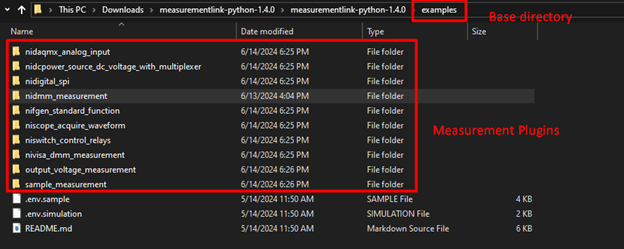
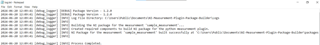
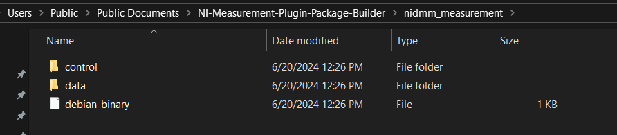
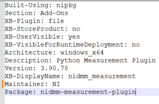
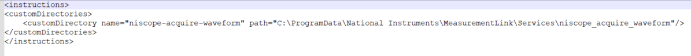
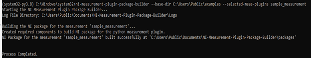
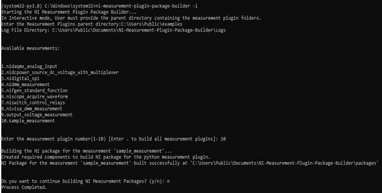

# NI Measurement Plugin Package builder

- [NI Measurement Plugin Package Builder](#ni-measurement-plugin-package-builder)
  - [Who](#who)
  - [Problem statement](#problem-statement)
  - [Links to relevant work items](#links-to-relevant-work-items)
  - [Implementation and Design](#implemenation-and-design)
    - [Workflow](#work-flow)
    - [CLI](#cli)
        - [Non interactive mode](#non-interactive-mode)
        - [Interactive mode](#interactive-mode)
        - [Logger implementation](#logger-implementation)
    - [Building measurement packages](#building-measurement-packages)
        - [Creating required files](#creating-required-files)
        - [Building measurements using nipkg exe](#building-measurements-using-nipkg-exe)
    - [Installation](#installation)
        - [Non interactive mode](#non-interactive-mode)
        - [Interactive mode](#interactive-mode)
  - [Alternative implementations and designs](#alternative-implementations-and-designs)
  - [Open issues](#open-issues)

## Who

Author: National Instruments
Team: ModernLab Success

## Problem statement

- Building python measurement plugin involves a lot of tedious processes of creating files with required information about packaging and running the `nipkg.exe` to build the measurement.

## Links to relevant work items

- [Feature - Measurement Utility Builder](https://dev.azure.com/ni/DevCentral/_sprints/taskboard/ModernLab%20Reference%20Architecture/DevCentral/24C2/06/06b?workitem=2773393)
- [Prototype Demo video](https://nio365.sharepoint.com/:v:/r/sites/ModernLabReferenceArchitecture/Shared%20Documents/Recordings/Measurement%20Builder%20Utility%20-%20Python/ni-measurement-plugin-package-builderV1.2.0-dev1_demo.mp4?csf=1&web=1&e=fkldX4)
- [Prototype Source Code](https://github.com/ni/ni-measurement-plugin-package-builder/tree/main)

## Implementation and Design

### Workflow

NI Measurement Plugin Package Builder builds python measurement plugins as NI package files, thereby reducing the manual efforts of creating the files information about packaging and running the `nipkg.exe` to build the measurement. The Built measurements are available under specific file location shown in the CLI. The CLI Tool prompts the user with necessary information about the input required and output created. It validates the provided measurement plugin by checking for files `measurement.py, pyproject.toml, start.py`. As these files are required for running the measurement in discovery services. If any one of these file getting missed it warns the user with appropriate message and not building the package.  CLI will inform the user about the progress of building packages through status messages, for any unexpected event occurs the `log.txt` file path will be prompted on the CLI to check and debug the issue.

### CLI

Command Line Interface implemented for `ni-measurement-plugin-package-builder` using `click` module, Please refer this [link](https://click.palletsprojects.com/en/8.1.x/) to know more about the module. `click` is designed to be simple and easy to use. It provides decorators for defining commands and options, which makes the code more readable and maintainable. The module provides strong typing and validation for command-line parameters, ensuring that the input is of the expected type and format before your code runs.

#### Non-interactive mode

Non interactive mode involves interaction with the tool through arguments. It supports building both single and multiple measurement package files.
The argument `--plugin-dir` as input with measurement plugin directory builds single measurement. The inputs should be enclosed within double quotes.
Arguments `--base-dir` and `--selected-meas-plugins` are used for building multiple measurements, whereas the `--base-dir` has the input of base directory with measurement plugins and `--selected-meas-plugins` has the input of comma separated measurement plugin names under that base directory or or `dot(.)` to build all the available measurement plugins under that base directory. It validates the user provided input and throw necessary warnings in the CLI.

Arguments like `--plugin-dir, --base-dir, --selected-meas-plugins` can be used with their corresponding shorthand versions `-p, -b, -s` in non-interactive mode.

#### Interactive mode

Interactive mode involves interaction with the tool through prompting. Once the user run the tool with this argument `-i`, It starts prompting the user with necessary inputs.
It initially prompts the user with the base directory of measurement plugin and list down the available measurement for better user experience. After selecting the required measurement from the list or `dot(.)` for building all the measurements. Here in this mode the tool will be prompting again for continue further building of measurements.

#### Logger implementation

Logger implementation plays a crucial role in this tool for displaying the status messages of the built measurement and as a debugger for debugging any unexpected behaviour.
Two types of logger has been implemented in this tool one is `console logger` and another is `File logger`. Console logger is used for displaying messages in the console whereas the File logger is used for logging all type of messages in a separate file called `log.txt`. Both the logger logs the messages with different format, the console logger logs the message as plain text, In file logger the time stamp along with log message type will be logged.

For example,

Initially the console logger gets loaded and then the file logger gets loaded, here in file logger all the console messages along with any exception messages and traceback of it will be logged.

Log file will be created under folder `NI-Measurement-Plugin-Package-Builder/Logs`, these folders will be created during the execution of tool, if not exists.
The tool will create those folders in either **User's My Documents directory path** or **Public Documents directory path** based on the available permissions. If not it will utilize the user provided input path.

### Building measurement packages

#### Creating required files

For building the measurement plugin packages, it requires certain files in particular folder heirarchy.

Control folder contains single file `control` which has information about maintainer, version, system architecture etc., Some of those information have been from the `pyproject.toml`, if the pyproject.toml doesn't has those information default values would be used in that place.

Data folder contains the copied measurement plugins files under the separate folder with measurement name and `instructions` file which contains the information about the storing the measurement files to the `discovery services` after installation of the measurement package.

All these folders will be placed under the folder named with the `measurement plugin name` parallel to the `Logs` folder.

#### Building measurements using nipkg exe

Once the required files have been created under the respective folders. The tool executes some commands using these [instructions](https://www.ni.com/docs/en-US/bundle/package-manager/page/build-package-using-cli.html)

### Installation

- Open Command Prompt.

- Run the command to install the whl file, `pip install <path_to_ni_measurement_plugin_package_builder-X_X_X-py3-none-any.whl>`

- There are two ways to which user can build packages,
  - Non-interactive mode
  - interactive mode

#### Non interactive mode

- To build a single measurement plugin, run the command
  `ni-measurement-plugin-package-builder --plugin-dir <measurement_plugin_directory>`
  For example,
  `ni-measurement-plugin-package-builder --plugin-dir "C:/Users/examples/sample_measurement"`
- To build multiple measurement plugins, run the command
  `ni-measurement-plugin-package-builder --base-dir <measurement_plugin_base_directory> --selected-meas-plugins <list_of_comma_separated_meas_plugins>`
  For example,
  `ni-measurement-plugin-package-builder --base-dir “C:/Users/examples” --selected-meas-plugins “sample_measurement,test_measurement”`
- Input arguments should be provided within double quotes.
- For building multiple measurements both the required inputs will be required like base directory and selected measurement plugins.
  

#### Interactive mode

- To start the tool in interactive mode, run the command
  `ni-measurement-plugin-package_builder -i`
- Users will be prompted to enter the required inputs for building measurements.
- To build multiple measurement plugins, the parent directory containing the measurement plugin folders must be provided.
- The command line interface will show the directory where the .nipkg files are generated.
  

## Alternative implementations and designs

No alternative implementations.

## Open issues

- This tool validates the individual measurement plugins at the time of building, not at the stage of prompting the available measurements.
- Measurement plugin name with commas cannot be used for building the measurement through non-interactive mode for multiple measurements.