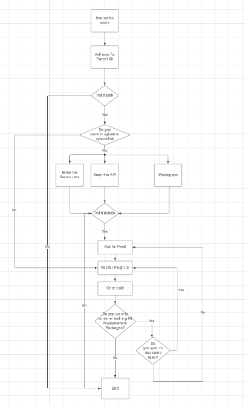

# NI Measurement Plug-In Package Builder

- [NI Measurement Plug-In Package Builder](#ni-measurement-plug-in-package-builder)
  - [Who](#who)
  - [Problem statement](#problem-statement)
  - [Links to relevant work items](#links-to-relevant-work-items)
  - [Implementation and Design](#implementation-and-design)
    - [Workflow](#workflow)
      - [Non-interactive mode](#non-interactive-mode)
      - [Interactive mode](#interactive-mode)
    - [NI SystemLink Feeds Manager](#ni-systemlink-feeds-manager)
    - [User inputs](#user-inputs)
      - [Logger implementation](#logger-implementation)
    - [Building measurement packages](#building-measurement-packages)
      - [Creating required files](#creating-required-files)
      - [Building measurements using nipkg exe](#building-measurements-using-nipkg-exe)
  - [Installation](#installation)
  - [Alternative implementations and designs](#alternative-implementations-and-designs)
  - [Open issues](#open-issues)

## Who

Author: National Instruments </br>
Team: ModernLab Success

## Problem statement

- For the test engineer, building a Python measurement plug-in involves a lot of tedious processes of creating files with the required information about packaging and running the `nipkg.exe` to build the measurement, and manually uploading those packages to SystemLink through the web server.

## Links to relevant work items

- [Feature - Measurement Utility Builder](https://dev.azure.com/ni/DevCentral/_sprints/taskboard/ModernLab%20Reference%20Architecture/DevCentral/24C2/06/06b?workitem=2773393)

## Implementation and Design

### Workflow

Create a Python package `NI Measurement Plug-in Package Builder` which builds Python measurement plug-ins as NI package files and uploads them to SystemLink feeds using the `NI SystemLink Feeds Manager` package, thereby reducing the manual efforts of creating the files with packaging information and running the `nipkg.exe` to build the measurement and uploading to SystemLink.

The built measurements are available under the specific file location shown in the CLI. The CLI Tool prompts the user with necessary information about the inputs required and the outputs created.

It validates the provided measurement plug-in by checking for the required files `measurement.py, pyproject.toml, start.py` for running the measurement in discovery services.

If any of these files get missed, it warns the user of the appropriate message and does not build the package. CLI will inform the user about the progress of building packages and uploading to SystemLink through status messages. If any unexpected event occurs, the `log.txt` file path will be prompted on the CLI to check and debug the issue.

#### Non-interactive mode

The non-interactive mode involves interaction with the tool through arguments. It supports building both single and multiple measurement package files and uploading them to SystemLink. The inputs should be enclosed within double quotes. It validates the user-provided input and throws necessary warnings in the CLI.

To build single measurement,

```
ni-measurement-plugin-package-builder --plugin-dir "C:\Users\examples\sample_measurement"
```

To build multiple measurements,
```
ni-measurement-plugin-package-builder --base-dir "C:\Users\examples" --selected-meas-plugins "sample_measurement,testing_measurement"
```

To upload the single measurement package to SystemLink,
```
ni-measurement-plugin-package-builder --plugin-dir "C:\Users\examples\sample_measurement" --upload-packages --api-url "https://dev-api.lifecyclesolutions.ni.com/" --api-key "123234" --workspace "sample_workspace" --feed-name "example_feed"
```

To upload the multiple measurement packages to SystemLink,
```
ni-measurement-plugin-package-builder --base-dir "C:\Users\examples" --selected-meas-plugins "sample_measurement,testing_measurement" --upload-packages --api-url "https://dev-api.lifecyclesolutions.ni.com/" --api-key "123234" --workspace "sample_workspace" --feed-name "example_feed"
```

#### Interactive mode

Interactive mode involves interaction with the tool through prompting. Once the user runs the tool with this argument `-i`, it starts prompting the user for inputs.
It initially prompts the user with the base directory of the measurement plug-in, information about uploading the packages, and lists down the available measurements for a better user experience. Users can select the measurement plug-in by its index number to build the packages. Once the package is built, the prompt will ask the user for the next plug-in.

```
ni-measurement-plugin-package-builder -i
```


Note: The following files present in the measurement plug-in folder will be ignored while building the .nipkg files,

- .venv
- pycache
- .cache
- dist
- .vscode
- .vs
- .env
- poetry.lock
- .mypy_cache
- .pytest_cache
- coverage.xml

### NI SystemLink Feeds Manager

NI SystemLink Feeds Manager is a Python package to automate the process of publishing packages by creating the feeds and uploading the packages to the feeds using SystemLink APIs. Please refer to this [HLD](https://github.com/ni/modernlab-ref-architecture/blob/nisystemlink-feeds-manager/nisystemlink_feeds_manager/docs/HLD/nisystemlink_feeds_manager.md) for more information about the package.


### User inputs

- To build a single measurement plug-in package, users should pass the measurement plug-in directory.
- To build multiple measurement plug-ins, users should provide the path to the base directory that contains all the measurement plug-ins and can pass the list of measurement plugins to be packaged from the base directory.
- To upload the packages to SystemLink, user should pass the following inputs:
    - SystemLink Server API URL
    - SystemLink API Key
    - Workspace - Name of the workspace for which the user has access to create feed and upload packages
    - Feed Name - Name of the feed under which the packages need to be uploaded.
    - Overwrite - Boolean value for overwriting the already existing packages.

Note:
  - For uploading the packages, if the API URL and Workspace are not provided then the
  `SystemLink client configuration` will be utilized, whereas the API key and Feed name must be provided.
  - User can enter (dot) '.' to build all measurements in both modes.

#### Logger implementation

Logger implementation plays a crucial role in this tool for displaying the status messages of the built measurement and as a debugger for debugging any unexpected behavior.
Two types of loggers have been implemented in this tool, one is `console logger` and another is `File logger`. Console logger is used for displaying messages in the console whereas the File logger is used for logging all types of messages in a separate file called `log.txt`. Both the logger logs the messages with different formats, the console logger logs the message as plain text whereas the file logger logs the messages along with the time stamp.

For example,


Initially, the console logger gets loaded followed by the file logger. The file logger contains all messages, including console messages, as well as any exception messages and their traceback.

The log file will be created under the folder `NI-Measurement-Plugin-Package-Builder/Logs`, these folders will be created during the execution of the tool, if it does not exist.
The tool will create those folders in either **User's My Documents directory path** or **Public Documents directory path** based on the available permissions. If not, it will utilize the user-provided input path.

### Building measurement packages

#### Creating required files

Building the measurement plug-in packages requires a certain template.


The Control folder contains a single file `control` which has information about the maintainer, version and system architecture, etc. Some of that information has been from the `pyproject.toml`, if the pyproject.toml doesn't have this information default values would be used in that place.


The Data folder contains the copied measurement plug-in files under the separate folder with the measurement name and the `instructions` file contains the information about statically registering the measurement after installation of the measurement package


All these folders will be placed under the folder named with the `measurement plug-in name` parallel to the `Logs` folder.

#### Building measurements using nipkg exe

Once the required files have been created under the respective folders. The tool executes some commands using these [instructions](https://www.ni.com/docs/en-US/bundle/package-manager/page/build-package-using-cli.html)


## Installation

This python package can be installed using the pip install `<path_to_ni_measurement_plugin_packager-X_X_X-py3-none-any.whl>` command.

## Alternative implementations and designs

No alternative implementations.

## Open issues

- Measurement plug-in name with commas cannot be used for building the measurement through non-interactive mode for multiple measurements.
